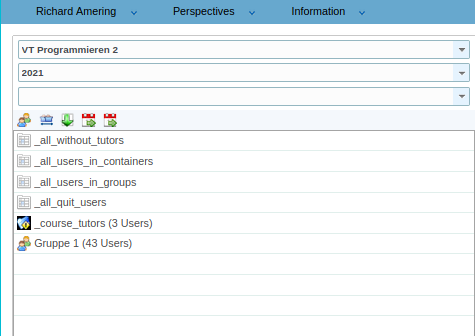
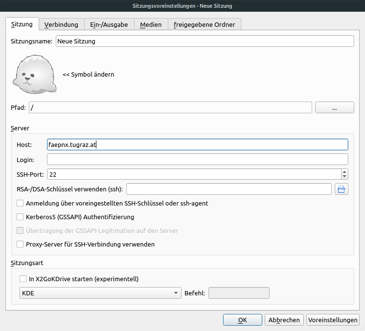
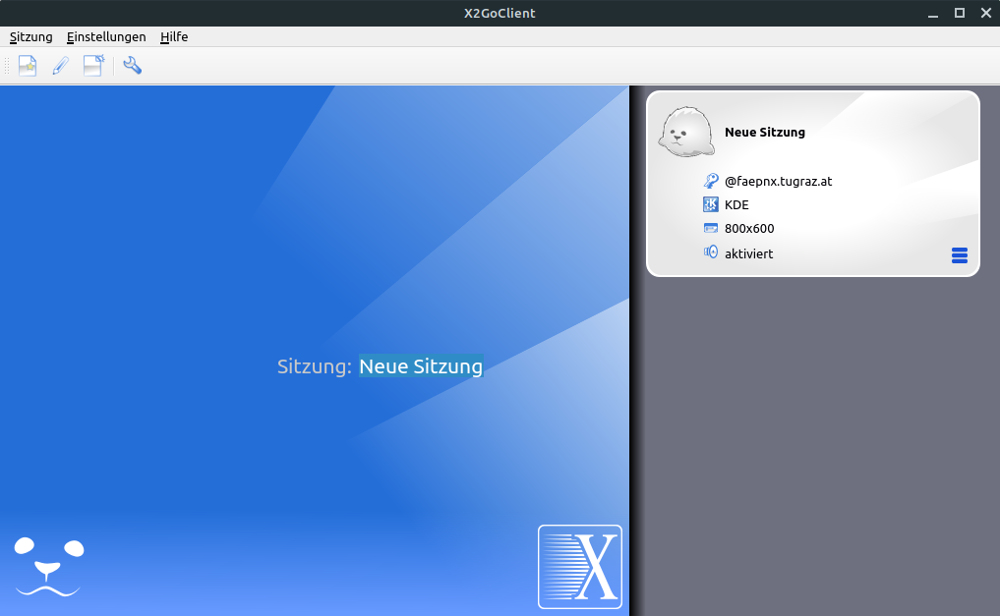
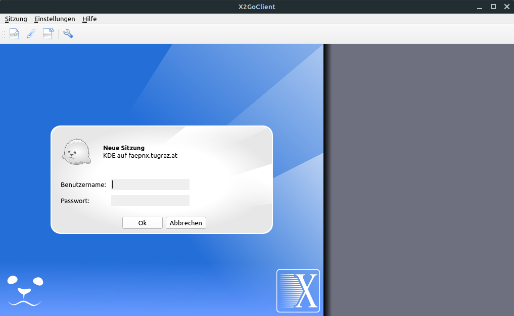
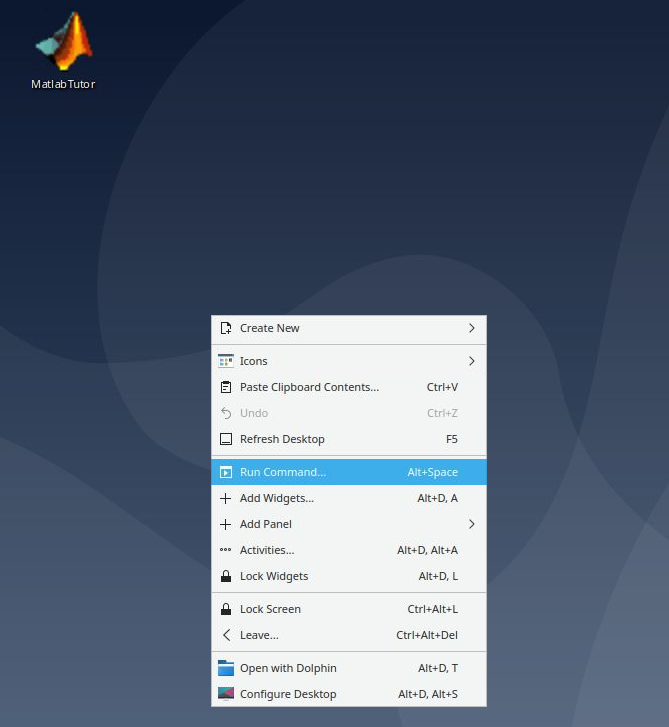
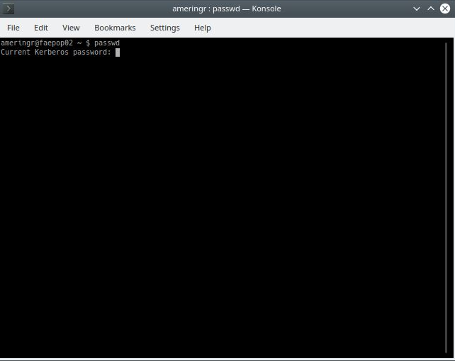

# Administration

## Creating new MatlabTutor Accounts 

When creating new accounts for the MatlabTutor, say for the students of your next course, it is important to understand that these accounts are not actually MatlabTutor specific. Instead, they belong to the ITP-Linux cluster, and Matlabtutor is simply using these accounts. Therefore, the first step of account-creation is to set up the according profiles in the linux-cluster. This will be done for you by the MatlabTutor supervisors. In order to do this, they need a csv-file containing all the new members in a certain format, like the follwing:

```
"Group","seq.no.","Place","Last name","First name","Incoming","Matriculation number","Reference number","Degree programme","Sem. within course of study","Date of registration","Email","Note"
```

As a teacher, you should be able to download a file with matching format from TU-Graz online. It is very important that the format matches exactly, otherwise the Matlab supervisors may have problems creating your accounts. It is not important what language you export your file in.

When the matlab-supervisors receive your data, they will create appropriate accounts, and also return a new file that you need for granting the new members MatlabTutor-access. It is again a csv-file, that you need upload to the MatlabTutor under the Administration-Perspective. Therefore, head to the perspective, and select the course you want your new members to be in on the left side, like in the following:



You will see 5 different icons in the top, responsible for creating new user-groups, and also one for importing users (third from the left), labeled 'Import users and groups'. Upon clicking it, you can upload the file you received from the supervisors, and should then be able to see the newly created accounts within their corresponding groups. In the example above, we have three members in the tutors group, and 43 members in group 1. The groups that the new accounts are displayed in correspond to the entries in the csv file you uploaded.
Meanwhile, the new members will be informed about their new accounts by email, and receive their login-credentials automatically.

## Changing Passwords
When new user accounts are created, it is recommended to change their passwords soon. Since Matlabtutor accounts are actually implemented in the Linux-cluster, passwords can not be changed within the Tutor-application. Instead, users need to access the cluster directly and update their login-data there. This can be achieved with an SSH-client, for example [X2Go](https://wiki.x2go.org/doku.php) or [Putty](https://www.chiark.greenend.org.uk/~sgtatham/putty/latest.html). It will allow us to remotely access a linux-desktop, as if we were working right on one of the cluster's machines. We will demonstrate the procedure to change a user-password using X2Go.
When starting the client, you will see one of the following windows:

````{panels}


---

 

````

You can access the second window by clicking 'New session' in the top left corner of the left window. Now we need to access the linux cluster, by connecting to one of the two servers:
      - faepnx.tugraz.at
      - faepnx.tu-graz.ac.at
In the example above, we already entered 'faepnx.tugraz.at' under 'Host'. When clicking 'Ok', you will be redirected to the first window, but with a new session available, as displayed on the right side. We can start the new session and connect to the linux-cluster by clicking the session on the right side. We will be asked to enter our login-credentials (the same login data we use to access MatlabTutor).

````{panels}


---

 

````

After we enter our data, a new window with a linux-desktop will open. This is our access to the cluster.
Next, we need to open a Bash-shell. Therefore, we right-click the desktop and click 'Run command...' in the context-menu. A search-window appears, where we enter 'Konsole' and hit enter. A bash-command-prompt will open subsequently.

````{panels}


---

 

````
````{panels}


````
If we enter the command `passwd` and hit enter, a password-manipulation-routine will be launched, allowing us to enter our current password, and then provide a new one, which we will have to confirm by typing it two times. Note that the characters you enter will not be displayed, even if the console recognizes them. It will appear as if it is not responding, which may cause some confusion at first. Don't let yourself be flustered, enter your passwords, and confirm with hitting enter. After you have succesfully changed your password, you can close your SSH session, and use you newly created password for accessing MatlabTutor.